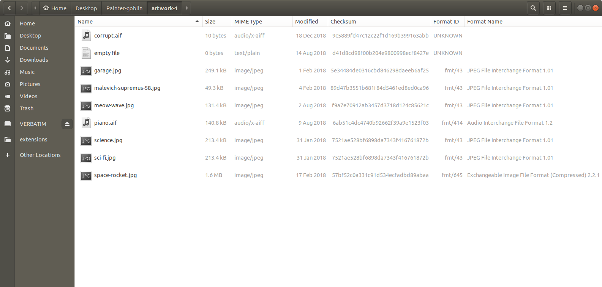
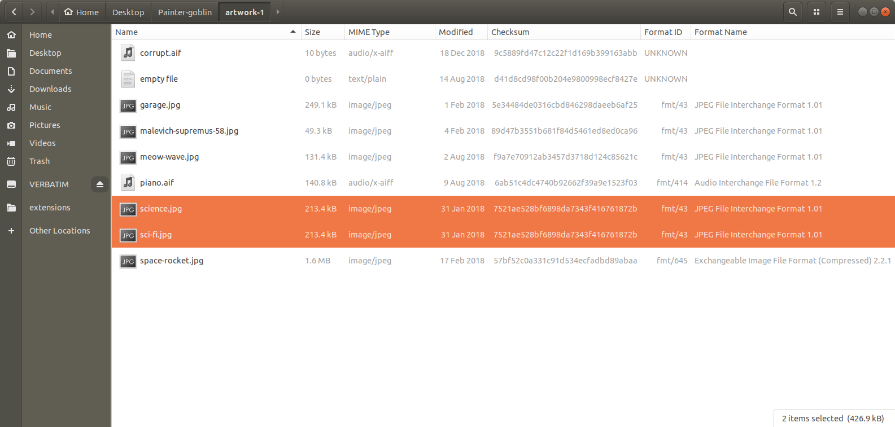
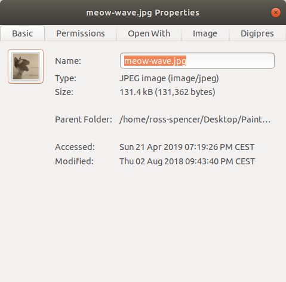
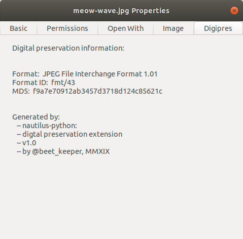
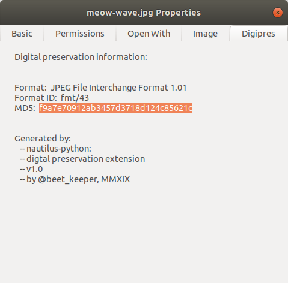

# nautilpres

Example digital preservation extensions for the nautilus file-manager.

## Introduction

A small hack I've been meaning to create for a while to demonstrate mechanisms
of extending a basic Linux operating system to provide basic digital
preservation information that might be useful to folk.

This repository provides users with a choice of two extensions for the nautilus
file manager:

* A panel extension to extend information provided looking at a file's
properties after clicking right-click -> Properties
* A nautilus columns extension to display digital preservation information in
the nautilus list view.

## Requirements

* Siegfried must be installed, and an absolute path must be setup for it in the
`digipres_helpers.py` script: [seen here][nautilpres-1].
* `nautilus-python` must be installed via a package manager such as `apt get`.
* The scripts must be installed in `~/.local/share/nautilus-python/extensions`.
* Whether you choose the columns or the properties script, both require
`digipres_helpers.py` which wraps Siegfried and checksum functions.
* Nautilus must be restarted, e.g. `$ nautilus -q`.

[nautilpres-1]: https://github.com/exponential-decay/nautilpres/blob/64882893baf59e1802045cda56222d26514880d6/digipres_helpers.py#L17-L19

## Recommendations

* I would recommend running one script or the other, but not both. As both
scripts calculate file checksums they can slow your system down. The column
extension more-so because it will try and calculate a sum per every file in a
folder.

* `digipres_columns_extension.py` is a nice demonstration but nautilus seems
to have restricted what is possible, for example, custom columns are not
sortable in Ubuntu 18.04 and so this limits the potential of this script.

* `digipres_props_extension.py` has some nice potential to be extended and
might be useful to folk wanting quick access to information such as a format
PUID (PRONOM unique identifier).

## Demonstration

### Columns extension

1. The columns extension will add checksum and PUID information to the nautilus
list-view:

2. I wanted it to be easier to display and potentially remove duplicates but
the extension information can no longer be sorted. It might be possible to do
this with older versions of Nautilus though:

### Properties extension

1. This has become my favorite while writing this today, a `Digipres` tab will
appear in your properties view:

2. When you click over to the tab you will see similar information to the
column view:

3. And the information can be selected so if you want to grab some quick
statistics about a file you can:

## What next?

If you give the scripts a whirl, let me know how it goes. Feedback would be
great.

## Questions

* What file-manager do you use?
* Is there a better file-manager?
* What is the future of nautilus?
	* Folks seem to say it is quite limited on forums, so maybe there is a
	better file-manager we can use in the field? That we can maybe also extend
	and provide easily accessible digital preservation output.
* What other information would you like to see?
* Have you already developed something similar?
	* If you have already done something similar, please do share! As well as
	if you take these examples and build on them.

## Resources

I've included addition resource information in the scripts, but I'll place it
here too:

* [Extension documentation.][ex-1]
* [Multimedia example.][ex-2]
* [Nautilus examples.][ex-3]

[ex-1]: https://projects-old.gnome.org/nautilus-python/documentation/html/index.html
[ex-2]: https://github.com/atareao/nautilus-columns
[ex-3]: https://github.com/GNOME/nautilus-python/tree/13d40c16dbf2df4dd007ae7961aa86aa235c8020/examples
